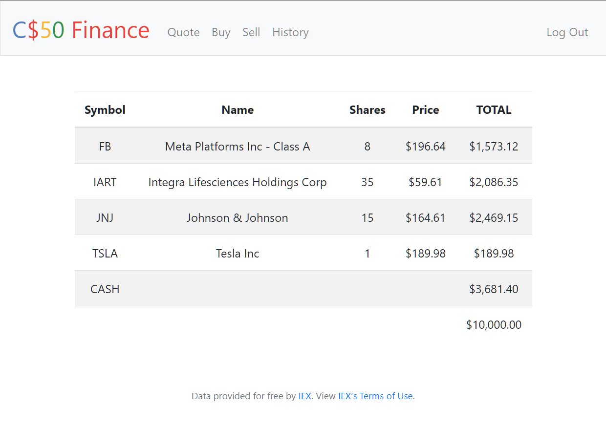
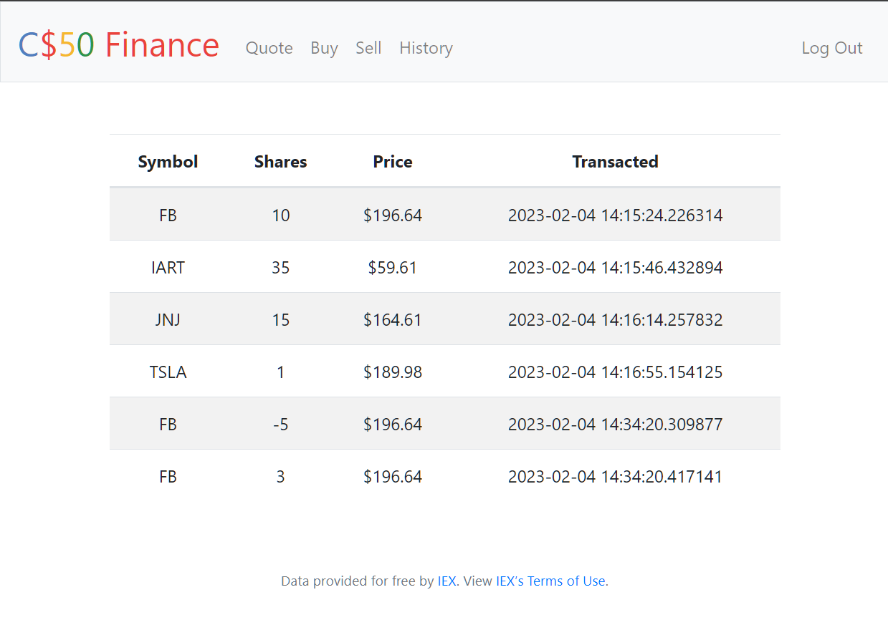
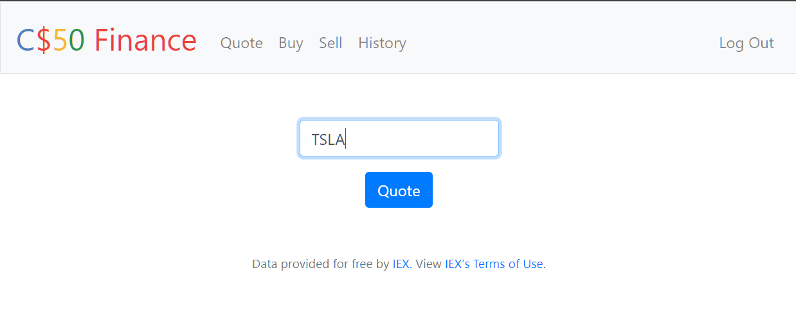
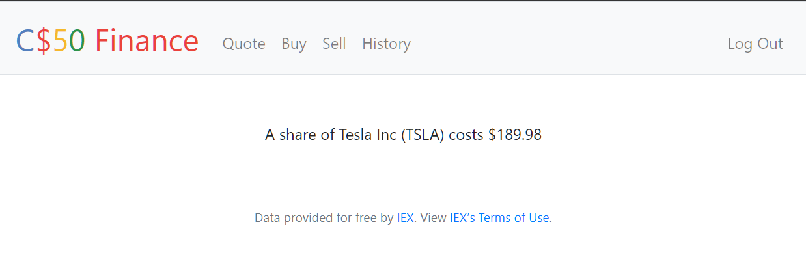

# Flask Web Application - "CS50 Finance"

Want to know the current price of TSLA? [Check out the live version](http://cs50finance-env.eba-es9d25zb.us-east-1.elasticbeanstalk.com/)
 

  

## Overview
Developed using vanilla JavaScript forkify is built using an MVC (Model View Controller) architecture pattern. Pulling data from an API it allows users to search recipes based on key words or ingredients. Functionality includes updating ingredient quantities based on your desired serving size and bookmarking your favourite recipes to access later. The application is hosted and can be viewed live on Netlify.  

## Motivation & Acknowledgements
This project was created while completing the HarvardX course CS50. 
CS50 finance is the project for week 9 of the course which brings all the course learning together into one web application. 
HTML and CSS styling for all elements of the application were provided as a template at the beginning of the project. 
[View the full assignment description on CS50's OpenCourseWater](https://cs50.harvard.edu/x/2023/psets/9/finance/)

## Features 

  

  

  

  

| User Story     | Feature |
| ----------- | ----------- |
|   Search for recipes    | Input field to send request to API with searched keywords. Display results with pagination. Display recipe with cooking time, servings and ingredients      |
| Update the number of servings   | Update all ingredients according to current number of servings        |
| Bookmark recipes   | Display list of all bookmarked recipes        |
| See my bookmarks when I come back later   | Store bookmark data in the browser using local storage. On page load, read saved bookmarks from local storage and display        |

## Architecture Patterns

- **MVC**: The application is "split" into three parts: the data(Model), the presentation of that data to the user(View), and the actions taken on any user interation(Controller). This design pattern creates a clean cut separation of concerns and allows for easier code maintainability and changes in the future. 
 

  

- **OOP**: Each view for the application (search, recipe, or results view) is represented as an object. All view objects inherit from a View.js parent class which contains methods and attributes common to all views. 
- **Publish/Subscribe**: The publish/subsribe design pattern is utilized to maintain a separation of concerns between the view and the controller. A handler function is added to each view to listen for any click events by the user. Once a click event is received the handler then calls the required function which is excuted by the controller. 

## Author
[James Waters](https://james-waters.com)
